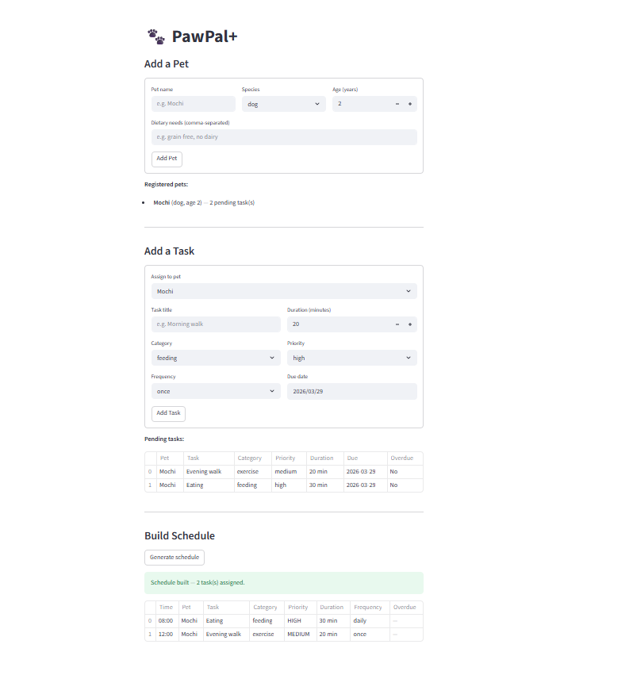

# PawPal+ (Module 2 Project)

You are building **PawPal+**, a Streamlit app that helps a pet owner plan care tasks for their pet.

## Scenario

A busy pet owner needs help staying consistent with pet care. They want an assistant that can:

- Track pet care tasks (walks, feeding, meds, enrichment, grooming, etc.)
- Consider constraints (time available, priority, owner preferences)
- Produce a daily plan and explain why it chose that plan

Your job is to design the system first (UML), then implement the logic in Python, then connect it to the Streamlit UI.

## What you will build

Your final app should:

- Let a user enter basic owner + pet info
- Let a user add/edit tasks (duration + priority at minimum)
- Generate a daily schedule/plan based on constraints and priorities
- Display the plan clearly (and ideally explain the reasoning)
- Include tests for the most important scheduling behaviors

## ✨ Features

### Core Object Model
- **Owner** tracks available time slots and owns a list of `Pet` objects — the single source of scheduling constraints
- **Pet** stores species, age, and dietary context, and owns its task list (composition, not loose coupling)
- **Task** holds category, duration, priority, frequency, and due date — all fields that directly affect scheduling decisions
- **Scheduler** is the brain: it reads constraints from `Owner`, pulls tasks from all pets via `get_all_tasks()`, and builds the plan

### Scheduling Algorithms
- **Priority-first planning** — `build_plan()` sorts tasks before assigning them: overdue tasks are promoted to the front, then tasks are ordered by priority (`high → medium → low`) using a stable sort
- **Chronological display** — `sort_by_time()` converts `"HH:MM"` slot strings to total minutes and returns `(slot, task)` pairs in ascending clock order, so output is always readable regardless of insertion order
- **Task filtering** — `filter_tasks(status, pet_name)` lets you query the live schedule by completion status, by pet, or both at once; uses Python `id()` identity checks to reliably match task objects back to their owning pet

### Conflict Handling
- **Non-fatal overlap warnings** — `assign_task()` checks every incoming task against all already-scheduled tasks using interval arithmetic (`start_a < end_b and start_b < end_a`); on overlap it records a human-readable warning and skips the task instead of raising an exception, so the rest of the schedule continues building
- **Post-build conflict audit** — `detect_conflicts()` scans every pair of scheduled tasks with `itertools.combinations` and labels each conflict as `same_pet` or `cross_pet`, useful for surfacing subtle overlaps that slipped through

### Task Lifecycle
- **Daily recurrence auto-advance** — calling `mark_complete()` on a `frequency="daily"` or `frequency="weekly"` task automatically moves its `due_date` forward by the correct `timedelta` and resets status to `"pending"`, so the task reappears in the next `build_plan()` without manual intervention
- **Overdue detection** — `is_overdue()` compares `due_date` against today using `datetime.date` and only flags tasks still in `"pending"` status

## 📸 Demo




## Getting started

### Setup

```bash
python -m venv .venv
source .venv/bin/activate  # Windows: .venv\Scripts\activate
pip install -r requirements.txt
```

### Suggested workflow

1. Read the scenario carefully and identify requirements and edge cases.
2. Draft a UML diagram (classes, attributes, methods, relationships).
3. Convert UML into Python class stubs (no logic yet).
4. Implement scheduling logic in small increments.
5. Add tests to verify key behaviors.
6. Connect your logic to the Streamlit UI in `app.py`.
7. Refine UML so it matches what you actually built.

## Testing PawPal+

### Run the test suite

```bash
python -m pytest tests/pawpal_test.py -v
```

### What the tests cover

| Test | What it verifies |
|------|-----------------|
| `test_mark_complete_changes_status` | A task starts as `"pending"` and becomes `"complete"` after `mark_complete()` |
| `test_add_task_increases_pet_task_count` | `add_task()` correctly grows a pet's task list |
| `test_sort_by_time_returns_chronological_order` | `sort_by_time()` returns `(slot, task)` pairs in ascending clock order regardless of insertion order |
| `test_daily_task_advances_due_date_after_complete` | Completing a `frequency="daily"` task moves its `due_date` forward by exactly one day and resets `status` to `"pending"` |
| `test_conflict_detection_warns_on_duplicate_slot` | `assign_task()` keeps the first task, skips the second, and records a warning when two tasks share the same time slot |

### Confidence Level

**3 / 5 stars**

The five tests cover the most critical happy paths and one key conflict scenario, giving solid confidence in core task lifecycle and scheduling correctness. The remaining two stars are withheld because the suite does not yet cover: overdue prioritization in `build_plan()`, the `filter_tasks()` query logic, cross-slot overlap detection (e.g. `08:00` + 60 min vs `08:30`), or the behavior of `"once"` vs `"weekly"` recurrence — all areas where subtle bugs could still hide.
